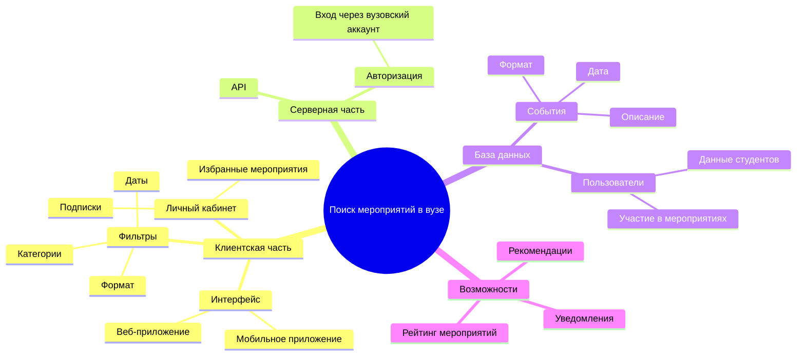
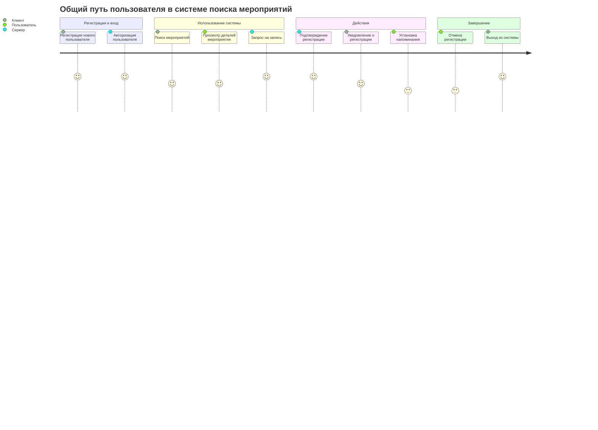
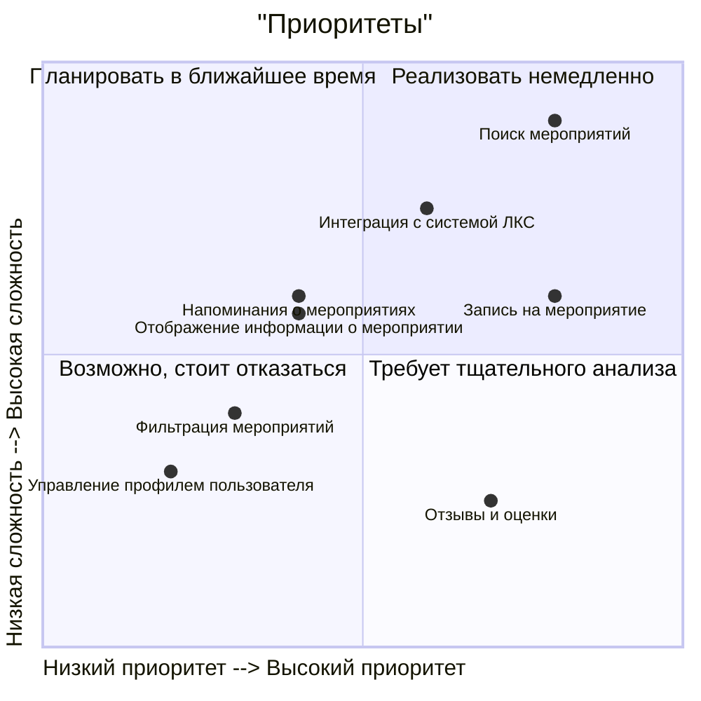

```mermaid
mindmap
  root((Поиск мероприятий в вузе))
    Клиентская часть
      Интерфейс
        Веб-приложение
        Мобильное приложение
      Фильтры
        Категории
        Даты
        Формат
      Личный кабинет
        Избранные мероприятия
        Подписки
    Серверная часть
      API
      Авторизация
        Вход через вузовский аккаунт
    База данных
      События
        Дата
        Формат
        Описание
      Пользователи
        Данные студентов
        Участие в мероприятиях
    Возможности
      Рекомендации
      Уведомления
      Рейтинг мероприятий
```

```mermaid
journey
  title Общий путь пользователя в системе поиска мероприятий
  section Регистрация и вход
    Регистрация нового пользователя: 5: Клиент
    Авторизация пользователя: 5: Сервер
  section Использование системы
    Поиск мероприятий: 4: Клиент
    Просмотр деталей мероприятия: 4: Пользователь
    Запрос на запись: 5: Сервер
  section Действия
    Подтверждение регистрации: 5: Сервер
    Уведомление о регистрации: 4: Клиент
    Установка напоминания: 3: Пользователь
  section Завершение
    Отмена регистрации: 3: Пользователь
    Выход из системы: 5: Клиент

```

```mermaid
quadrantChart
    title "Приоритеты"
    x-axis "Низкий приоритет --> Высокий приоритет"
    y-axis "Низкая сложность --> Высокая сложность"
    quadrant-1 "Реализовать немедленно"
    quadrant-2 "Планировать в ближайшее время"
    quadrant-3 "Возможно, стоит отказаться"
    quadrant-4 "Требует тщательного анализа"
    "Поиск мероприятий": [0.8, 0.9]
    "Запись на мероприятие": [0.8, 0.6]
    "Напоминания о мероприятиях": [0.4, 0.6]
    "Фильтрация мероприятий": [0.3, 0.4]
    "Управление профилем пользователя": [0.2, 0.3]
    "Интеграция с системой ЛКС": [0.6, 0.75]
    "Отображение информации о мероприятии": [0.4, 0.57]
    "Отзывы и оценки": [0.7, 0.25]

```

```mermaid
gitGraph
   commit id: "Инициализация"
   commit id: "Добавление структуры проекта"
   branch feature/authorization
   checkout feature/authorization
   commit id: "Реализована регистрация"
   commit id: "Реализована авторизация"
   checkout main
   merge feature/authorization
   branch feature/mero
   checkout feature/mero
   commit id: "Добавлен поиск мероприятий"
   commit id: "Реализованы фильтры"
   checkout main
   merge feature/mero
   branch feature/notifications
   commit id: "Добавлена возможность установки напоминаний"
   checkout feature/notifications
   commit id: "Добавлены уведомления по времени"
   checkout main
   merge feature/notifications
   branch hotfix/fix_issues
   checkout hotfix/fix_issues
   commit id: "Исправлен баг с поиском"
   commit id: "Исправлены баги с фильтрами"
   checkout main
   merge hotfix/fix_issues
   commit id: "Релиз первой версии"
```
